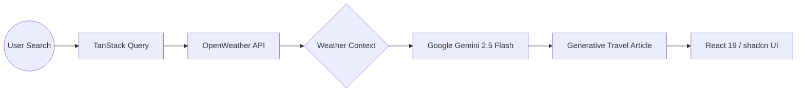

# 🌤️ Weather AI: Generative Travel Intelligence

**Weather AI** isn't just a forecast—it's your personal travel journalist. By combining real-time meteorological data with **Google Gemini 2.5 Flash**, the application generates custom travel articles, local insights, and itinerary suggestions based on current conditions in any city on Earth.

---

## 📱 Product Preview

[![Product Name Screen Shot][product-screenshot]](https://github.com/andyfrith/weather-reactjs)

---

## ✨ Key Features

- **📝 Zod OpenAPI Client**: Leverage the power of Zod and OpenAPI to ensure that the data consumed from the API is always valid and correctly typed.
- **🏗️ Foundational Build**: A simple, un-opinionated starting point focused on clean data fetching and state management.
- **🛡️ Contract-First Development**: By using the Zod OpenAPI client, the frontend stays perfectly in sync with the backend's documented schema.
- **⚡ Vite-Powered**: Instant hot-reloading and an optimized build pipeline for a superior developer experience.

---

## 🔗 The Integration Layer

This client connects to the **Weather API** (Hono/Bun). Instead of loose `fetch` calls, it utilizes a generated or schema-driven client via **Zod OpenAPI**. This eliminates the common "API drift" problem where frontend types become outdated compared to the actual API responses.

### Why this matters:

- **Validation at the Edge**: Data is validated as it enters the React application.
- **Intelligent Autocomplete**: TypeScript knows exactly what the weather object looks like based on the API's OpenAPI specification.
- **Error Resilience**: Unexpected API changes are caught at the networking layer before they crash the UI.

## 🏗️ Architecture: Data-to-Article Flow

The application utilizes a sophisticated pipeline where raw weather data is transformed into human-readable travel advice via the Google Gemini 2.5 Flash model.

A clean, foundational **React.js** application designed to consume the [Weather API](https://github.com/andyfrith/weather-api). This project serves as a streamlined starting point for building modern React frontends with **strict contract-based integration**.

---

## 🧠 AI-Augmented Features

### ✍️ Generative Travel Journalism

Beyond raw numbers, the app uses **Gemini 2.5 Flash** to author localized "Perfect Day" articles. It considers temperature, precipitation, and time of day to suggest whether to visit a hidden rooftop bar or a cozy underground jazz club.

### 🌍 Intelligent Activity Filtering

The AI engine analyzes the weather "vibe"—identifying the difference between a "crisp autumn morning" and a "humid summer afternoon"—to prioritize indoor vs. outdoor recommendations.

### 🎨 Dynamic Contextual Theming

The UI isn't static; it adapts its aesthetic language based on the AI's generated content, ensuring the visual experience matches the weather's mood.

### 📍 Hyper-Local Itineraries

Gemini generates specific **points of interest (POIs)** and cultural tidbits that traditional weather apps overlook, turning a forecast into a roadmap.

---

## ⚡ Best-in-Class Development Practices

- **React 19 Concurrent Architecture:** Utilizing the latest React 19 features, including the `use()` hook for streamlined data resolution and improved transition handling for smooth AI content streaming.
- **Optimized AI Inference:** Specifically targeting the **Gemini 2.5 Flash** model to provide sub-second generative responses, ensuring the AI content arrives simultaneously with the weather metrics.
- **TanStack Power Suite (v5):** Implementing advanced asynchronous state management. The app uses intelligent caching, stale-while-revalidate logic, and request deduplication to minimize API latency and operational costs.
- **Contract-First Design & Zod:** Every boundary—from the weather API to the AI's JSON output—is enforced by **Zod schemas**. This ensures the application is resilient against "hallucinations" and external API changes.
- **Atomic UI with shadcn/ui:** Leveraging Radix UI primitives and **Tailwind CSS v4** to build a design system that is accessible (WCAG compliant), performant, and highly customizable.
- **Vertical Type Safety:** Leveraging **TypeScript's** full power to ensure that types defined at the API layer are propagated correctly through the AI prompt logic and into the UI components.

## 📫 Let's Connect

- **Portfolio**: [andyfrith.com](https://andyfrith.com)
- **LinkedIn**: [linkedin.com/in/goodapplemedia](https://linkedin.com/in/goodapplemedia)
- **GitHub**: [@andyfrith](https://github.com/andyfrith)

> _"Delivering sound, proven, and trusted architecture solutions that are ready for any challenge."_

[product-screenshot]: /screenshot-denver.png
